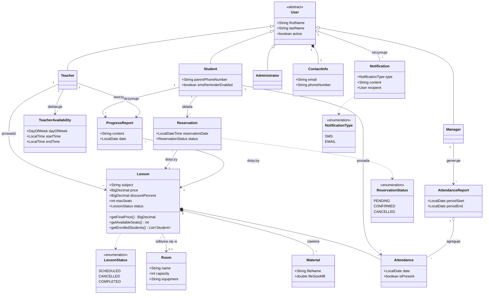

# Scuola — System zarządzania szkołą korepetycji


Projekt zaliczeniowy na laboratorium z Inżynierii Oprogramowania modelujący system zarządzania szkołą korepetycji. 

Warstwa danych jest zrealizowana w pamięci - ona obsługuje zapytania typu
„pobierz wszystkie zajęcia".

---

## Spis treści

- [Funkcjonalności](#funkcjonalności)
- [Architektura warstwowa](#architektura-warstwowa)
- [Zapytania do bazy danych (repozytoria)](#zapytania-do-bazy-danych-repozytoria)
- [Diagram klas (model dziedziny)](#diagram-klas-model-dziedziny)
- [Serwisy](#serwisy)
- [Struktura projektu](#struktura-projektu)
- [Wymagania](#wymagania)
- [Rodzaje testów](#rodzaje-testów)
- [Uruchamianie testów](#uruchamianie-testów)
- [Decyzje projektowe](#decyzje-projektowe)

---

## Funkcjonalności

### Użytkownicy i kadra (`scuola.users`)
- Hierarchia: abstrakcyjny `User` → `Student`, `Teacher`, `Administrator`, `Manager`.
- Dane kontaktowe (`ContactInfo`), flaga aktywności konta (`active`).
- Zarządzanie kadrą (`UserService`): tworzenie pracownika, lista, aktualizacja, dezaktywacja.
- Dostępność nauczyciela (`AvailabilityService`): zapis z wykrywaniem konfliktów oraz odczyt (`listAvailability`, `listAllAvailability`).

### Harmonogram, rezerwacje i sale (`scuola.lessons`)
- `Lesson` z ceną, rabatem (`getFinalPrice`), limitem miejsc (`getAvailableSeats`), listą zapisanych (`getEnrolledStudents`) i statusem (`LessonStatus`).
- `Reservation` ze statusem (`ReservationStatus`); `Room` (sala).
- `ReservationService`: przeglądanie zajęć z filtrem, rezerwacja z kontrolą miejsc, anulowanie z regułą 24h, rezerwacja na okres, eksport do kalendarza.
- `ScheduleService`: listy zajęć, przypisywanie i zwalnianie sal, zastępstwa, anulowanie zajęć, przenoszenie terminów, lista wolnych nauczycieli.
- `LessonService`: edycja szczegółów i cen zajęć.

### Dziennik: obecności, materiały, notatki (`scuola.attendance`)
- Obecności i próg nieobecności (`AttendanceService`) z automatycznym powiadomieniem po przekroczeniu progu.
- Materiały dydaktyczne (`MaterialService`) z walidacją rozmiaru pliku (limit **100 MB**) i powiadomieniem zapisanych uczniów.
- Notatki o postępach — CRUD + historia (`ProgressReportService`).
- Raporty obecności i eksport (`ReportService`, `AttendanceReport`).

### Powiadomienia (`scuola.notifications`)
- Kanały `SMS`/`EMAIL` (`NotificationType`), adresat powiadomienia (`Notification.recipient`).
- Wysyłka uproszczona do komunikatu w konsoli; powiadomienie jest dopinane do odbiorcy (umożliwia testowanie).

---

## Architektura warstwowa

Kod jest zorganizowany w widoczny sposób:

```
Boundary  ─→  UI / Main / testy            (wywołują serwisy)
    │
Control   ─→  *Service                     (logika aplikacji)
    │
Dane      ─→  *Repository                  (warstwa danych — „baza" w pamięci)
    │
Entity    ─→  Lesson, Reservation, User …  (encje)
```

---

## Zapytania do bazy danych (repozytoria)

W diagramach sekwencji uczestnik „Baza Danych" został zastąpiony konkretnymi encjami.

Bazowa klasa `InMemoryRepository<T>` udostępnia operacje CRUD i `findAll()`
(odpowiednik `SELECT *`), a repozytoria dziedziczące dokładają wyszukiwania dziedzinowe:

```java
public abstract class InMemoryRepository<T> {
    public T save(T item) { /* ... */ }
    public boolean delete(T item) { /* ... */ }
    public List<T> findAll() { return List.copyOf(items); }   // pobierz wszystkie
}

public class LessonRepository extends InMemoryRepository<Lesson> {
    public List<Lesson> findByTeacher(Teacher teacher) { /* filtr */ }
    public List<Lesson> findScheduled() { /* status == SCHEDULED */ }
    public List<Lesson> findStartingBetween(LocalDate start, LocalDate end) { /* zakres dat */ }
}
```

Serwisy nie znają „bazy" bezpośrednio — odpytują repozytoria. Przykład „pobierz wszystkie zajęcia":

```java
// ScheduleService
public List<Lesson> listLessons() {
    return lessonRepository.findAll();
}
```

> Dzięki temu wymianę na prawdziwą bazę (JDBC/JPA) sprowadza się do podmiany
> implementacji repozytorium — reszta kodu pozostaje bez zmian.

Repozytoria w projekcie: `LessonRepository`, `ReservationRepository`, `RoomRepository`,
`UserRepository`, `AttendanceRepository`.

---

## Diagram klas (model dziedziny)

> Dla czytelności na diagramie pominięto serwisy (`*Service`) i repozytoria —
> ich wykaz znajduje się w sekcji [Serwisy](#serwisy).



---

## Serwisy

| Serwis | Pakiet | Kluczowe metody |
| --- | --- | --- |
| `ReservationService` | lessons | `getAvailableLessons`, `createReservation`, `cancelReservation`, `createReservations`, `countLessons`, `exportToCalendar` |
| `ScheduleService` | lessons | `listLessons`, `assignRoom`, `listAvailableRooms`, `substituteTeacher`, `cancelLesson`, `rescheduleLesson`, `listAvailableTeachers` |
| `LessonService` | lessons | `updateLessonDetails`, `setPrice` |
| `AvailabilityService` | users | `updateAvailability`, `submit`, `listAvailability`, `listAllAvailability` |
| `UserService` | users | `createEmployee`, `listEmployees`, `updateEmployee`, `deactivateEmployee` |
| `AttendanceService` | attendance | `markAttendance`, `updateAttendance`, `listStudentsForLesson`, `checkTooManyAbsences` |
| `MaterialService` | attendance | `uploadMaterial`, `deleteMaterial`, `listMaterials`, `downloadMaterial` |
| `ProgressReportService` | attendance | `createProgressReport`, `updateProgressReport`, `deleteProgressReport`, `listByStudent` |
| `ReportService` | attendance | `generateAttendanceReport`, `exportReport` |
| `NotificationService` | notifications | `sendReservationConfirmation`, `sendCancelNotice`, `sendMaterialNotice`, `notifyAbsences`, `sendLessonReminder` |

---

## Struktura projektu

```
Scuola/
├─ src/
│  ├─ Main.java                      # demonstracja działania systemu
│  └─ scuola/
│     ├─ users/                      # User, Student, Teacher, Administrator, Manager, ContactInfo,
│     │                              # TeacherAvailability, AvailabilityService, UserService, EmployeeRole
│     ├─ lessons/                    # Lesson, Reservation, Room, LessonStatus, ReservationStatus,
│     │                              # ReservationService, ScheduleService, LessonService
│     ├─ attendance/                 # Attendance, ProgressReport, Material, AttendanceReport, UploadedFile,
│     │                              # MaterialService, ReportService, ProgressReportService, AttendanceService
│     ├─ notifications/              # NotificationType, Notification, NotificationService
│     └─ repository/                 # InMemoryRepository + Lesson/Reservation/Room/User/AttendanceRepository
├─ test/
│  └─ org/scuola/
│     ├─ users/ lessons/ attendance/ notifications/ repository/   # testy jednostkowe
│     ├─ fixtures/                   # TestFixtures — wspólne dane testowe 
│     └─ acceptance/                 # testy akceptacyjne 
│─ pom.xml    
└─ README.md
```
## Wymagania
- **JDK 21 lub nowszy** (projekt rozwijany na JDK 25).
---
## Rodzaje testów

| Rodzaj | Pakiet | Zakres |
| --- | --- | --- |
| **Jednostkowe** | `scuola.*` (lustrzane do `src`) | Każda klasa testowana w izolacji. |
| **Akceptacyjne** | `scuola.acceptance` | Pełne procesy biznesowe (user stories) w stylu *Given / When / Then*. |

---

## Uruchamianie testów

Oczekiwany wynik:

```
[       168 tests successful      ]
[         0 tests failed          ]
```

---
## Decyzje projektowe

- **Warstwa danych** to repozytoria w pamięci (`InMemoryRepository` i pochodne) —
  realizują zapytania z diagramów sekwencji bez prawdziwej bazy danych.
- **Powiadomienia** są uproszczone do komunikatu w konsoli; każde jest dopinane do
  odbiorcy (`recipient`), dzięki czemu efekt można zweryfikować w testach.
  Serwisy `Reservation/Schedule/Attendance/Material` wywołują `NotificationService`
  zgodnie z diagramami sekwencji.
- Kolekcje zwracane przez encje są tylko do odczytu

---

## Autorzy

| Osoba | Rola |
| --- | --- |
| **Bartosz Badura** | Team leader |
| **Eryk Witkowski** | Członek zespołu |

> Projekt zaliczeniowy — przedmiot *Inżynieria Oprogramowania*.
